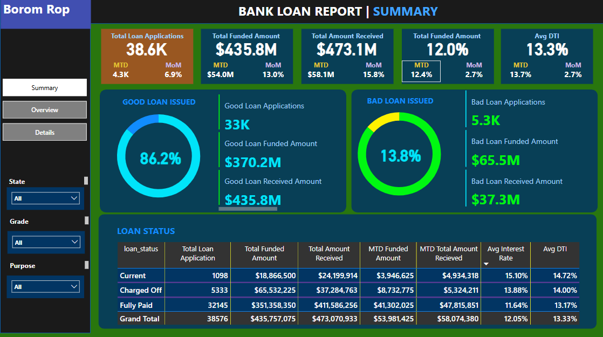
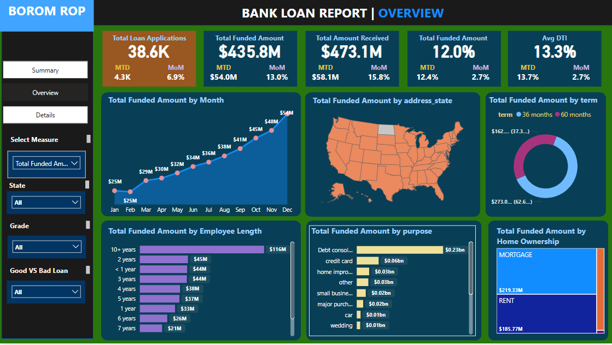
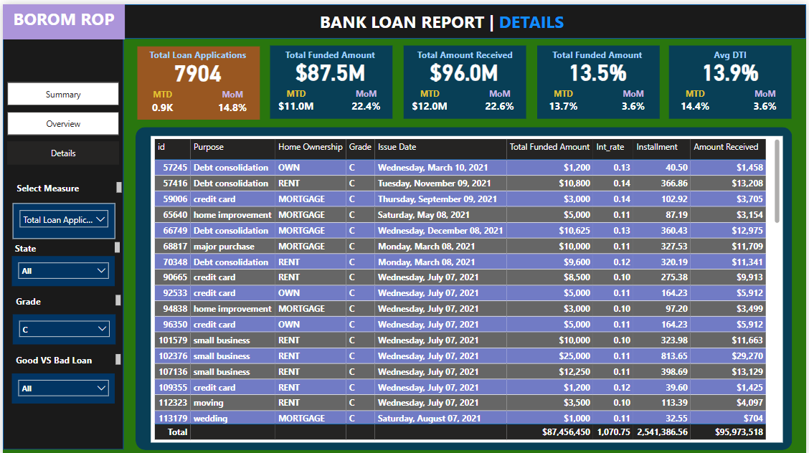
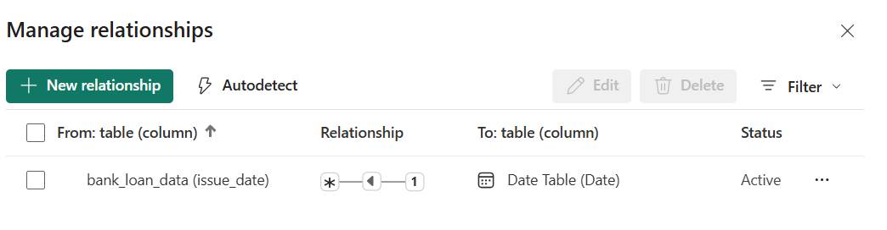
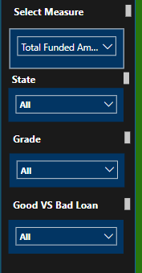

# Bank Loan Analysis Dashboard

A Power BI dashboard for analyzing bank loan data with comprehensive insights into loan performance, risk assessment, and business metrics.

## Overview

This project contains a three-page Power BI dashboard that provides detailed analysis of bank loan operations:

### Summary Page


- Key performance metrics: 38.6K total applications, $435.8M funded amount
- Good vs bad loan performance analysis (86.2% vs 13.8%)
- Month-to-date and month-over-month trend analysis
- Loan status breakdown by current, charged off, and fully paid categories

### Overview Page


- Monthly funding trends and seasonal patterns
- Geographic distribution across US states
- Employee length and loan purpose analysis
- Home ownership and loan term breakdowns

### Details Page


- Individual loan record details with filtering capabilities
- Complete loan attributes including amount, interest rate, and payment status

## Data Structure

The dashboard analyzes bank loan data with the following key components:

- Loan information: amount, funding, interest rates, terms
- Borrower demographics: income, employment, location, home ownership
- Performance metrics: loan status, grades, payment history
- Time-based analysis with date relationships for trend calculations

## Key Features

- Interactive filtering by state, grade, and loan purpose
- Month-to-date and period-over-period calculations
- Cross-visual filtering and drill-through capabilities
- Risk assessment through good vs bad loan classification

## Technical Implementation

- Built in Power BI Desktop
- Data model with fact table (bank_loan_data) and date dimension
- DAX measures for calculated metrics and time intelligence
- Relationship management between loan data and date tables

## Getting Started

1. Clone this repository
2. Open the .pbix file in Power BI Desktop
3. Update data source connections as needed
4. Refresh data to load current information

## Repository Structure

```
Bank-Loan-Analysis-Dashboard/
├── README.md
├── bank_loan_Dashboard.pbix
├── images/
│   ├── dashboard-preview.png
│   ├── summary-page.png
│   ├── overview-page.png
│   └── details-page.png
└── data/
    └── sample-data.csv
```

## Use Cases

- Risk management and loan portfolio monitoring
- Business performance tracking and reporting
- Geographic market analysis
- Operational dashboards for loan officers and management

## Screenshots

### Data Model


### Filter Options


## Contact

For questions or suggestions, please open an issue in this repository.
